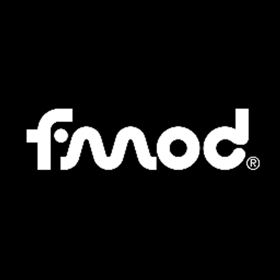
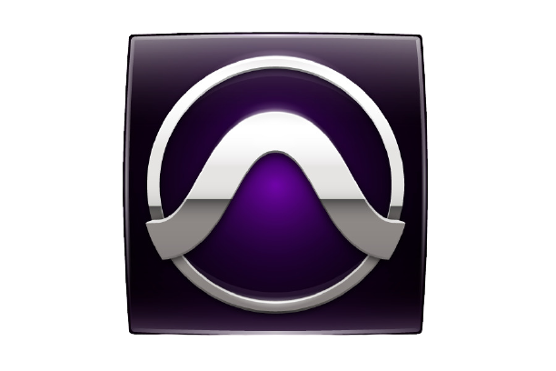
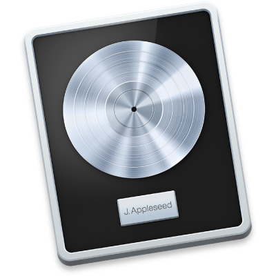

<!---->

 
Hello. My Name is Frederik Bjørn. I'm a sounddesigner, composer and drummer with and
interest for game development, making, mixing and recording music, and I like yatzy.

<h4><em> Contact </em></h4>
Email: Fbjoern18@gmail.com  
Tlf: 42 41 59 46  
Carrier pigeon: yes

 
<h4><em> Education </em></h4>
Attending a semester at the National Academy of Digital Interactive Entertainemt (DADIU), a part of The National Film School of Denmark, working as a sounddesigner at AAU in Aalborg.
 
<em> Autumn 2020</em>
 
 
Studying Sono- og mediekomminukation at Sonic College in Haderslev
 
<em>From 2018 to 2021</em>
 
 
Attending Christianshavs Gymnasium with majors in Music, Engish and Media Studies. 
 
<em>From 2011 to 2014</em>
 

<h4><em> Programs I use for productions </em></h4>

 

 
 
 
 
 
 
 
 

    

 
 
 
 
 
 
<em>frederikbjorn.com - 2020</em>

