<a style="text-decoration:none;font-family:times new roman;font-size:14px;text-decoration:none;">

For at hoste mine video bilag til <em>Eksamensopgaven DADIU</em> har jeg her oploaded mine bilag til min hjemmeside.
 
Disse bilag er kun til supplement til <em>Eksamensopgaven DADIU</em>, del derfor venlist ikke disse videoer.

<h3> Bilag 1 </h3>

Dette er en kort gennemspilning af muCALYtion 1.0, vores færdige produkt efter MiniGame I.

<video width="680" height="500" controls>
  <source src="minigame1-playthrough.mp4" type="video/mp4">
Din brower understøtter ikke dette video tag, venlist skift browser.

</video>

 
 

<h3> Bilag 2 </h3> 

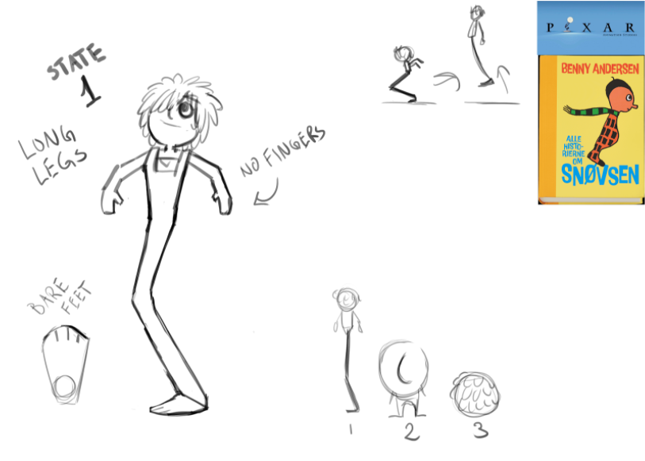

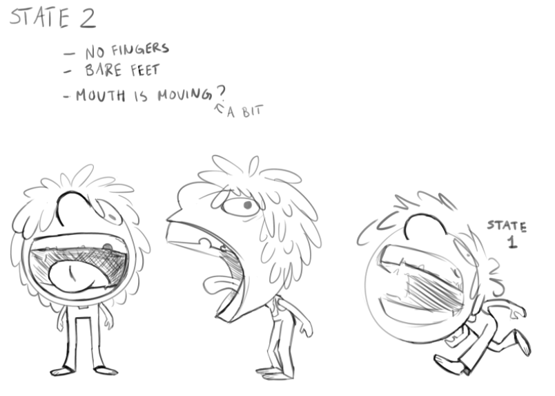

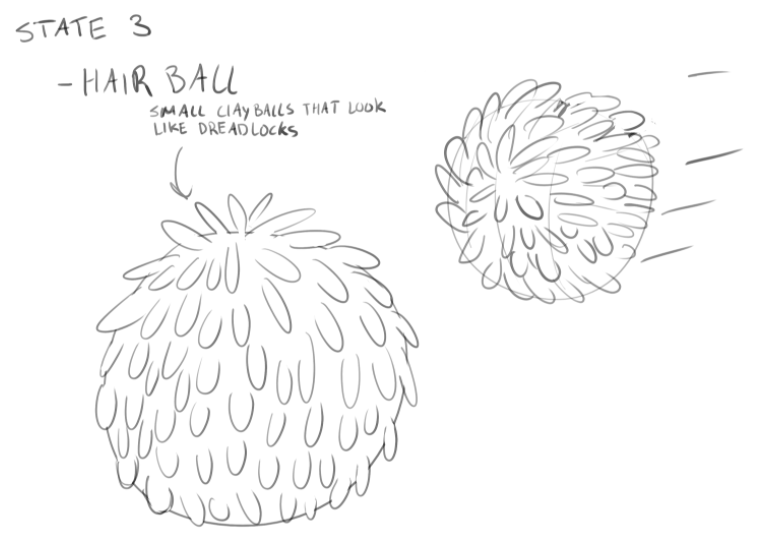

 

<h3> Bilag 3 </h3>

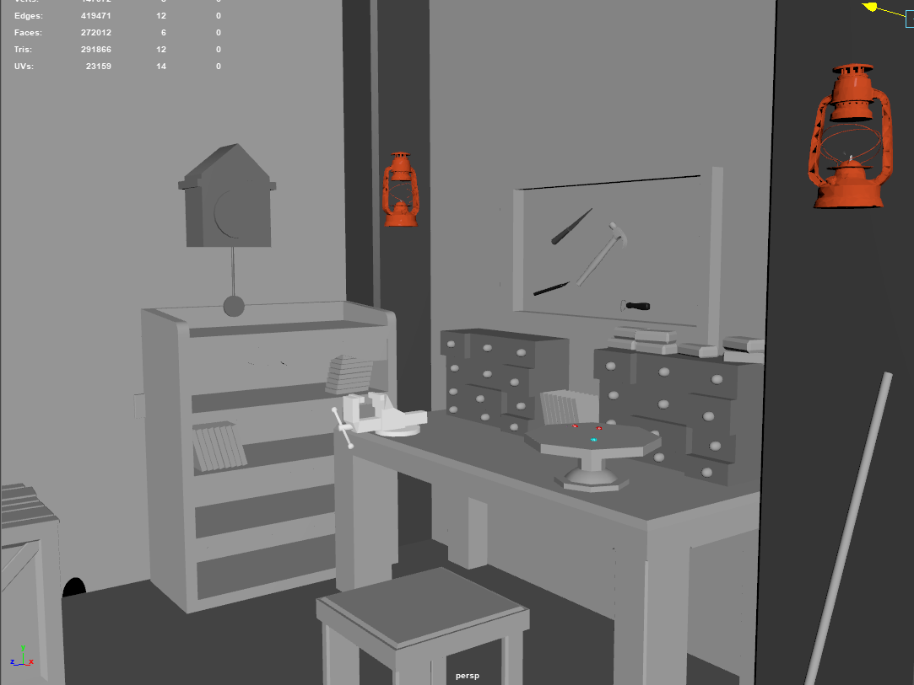

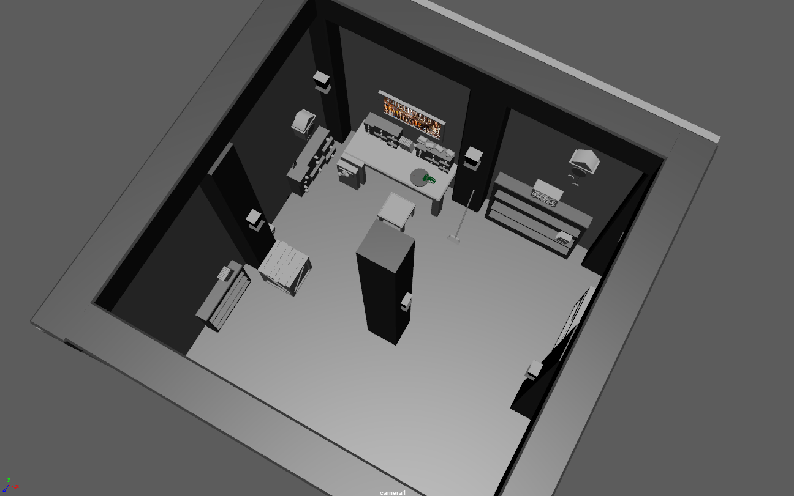

<h3> Bilag 4 </h3>

<h4> Fjende lydende </h4>

Kasserolle fjenden; variationer af døds impact lyden når man dræber en kasserolle (den er lavet af ler).

<audio controls>
<source src ="Enemy_Bowl_Destroy_01.mp3" type="audio/mpeg">
</audio>

 

<audio controls>
<source src ="Enemy_Bowl_Destroy_02.mp3" type="audio/mpeg">
</audio>

 

<audio controls>
<source src ="Enemy_Bowl_Destroy_03.mp3" type="audio/mpeg">
</audio>

 
 

Kasserolle fjenden; variationer af impact lyden når kasserollen dræber dig, narrativet er at den spiser dig.

<audio controls>
<source src ="Enemy_Bowl_Impact_04.mp3" type="audio/mpeg">
</audio>

 

<audio controls>
<source src ="Enemy_Bowl_Impact_05.mp3" type="audio/mpeg">
</audio>

 

<audio controls>
<source src ="Enemy_Bowl_Impact_06.mp3" type="audio/mpeg">
</audio>

 
 

Snegle fjenden; variationer af døds impact lyden når man dræber en snegl. Narrativet er at man sluger den med sin store mund.

<audio controls>
<source src ="Enemy_Slug_Destroy_08.mp3" type="audio/mpeg">
</audio>

 

<audio controls>
<source src ="Enemy_Slug_Destroy_10.mp3" type="audio/mpeg">
</audio>

 

<audio controls>
<source src ="Enemy_Slug_Destroy_12.mp3" type="audio/mpeg">
</audio>

 
 

Snegle fjenden; variationer af impact lyden når sneglen dræber dig. Narrativet er at den slynger dig rundt og kaster dig væk (dette bliver ikke vist visuelt i spillet da tiden løb knap)

<audio controls>
<source src ="Enemy_Slug_Impact_14.mp3" type="audio/mpeg">
</audio>

 

<audio controls>
<source src ="Enemy_Slug_Impact_16.mp3" type="audio/mpeg">
</audio>

 

<audio controls>
<source src ="Enemy_Slug_Impact_18.mp3" type="audio/mpeg">
</audio>

 
 

Tegnestift fjenden; variationer af lyden ved impact med tegnestiften.

<audio controls>
<source src ="Enemy_Pin_Destroy_20.mp3" type="audio/mpeg">
</audio>

 

<audio controls>
<source src ="Enemy_Pin_Destroy_22.mp3" type="audio/mpeg">
</audio>

 

<audio controls>
<source src ="Enemy_Pin_Destroy_24.mp3" type="audio/mpeg">
</audio>

 
 

<h4> Mutations lydende </h4>

Mutering til bold

<audio controls>
<source src ="Mutation_To_Ball.mp3" type="audio/mpeg">
</audio>

 

Mutering til den lille dreng med en stor mund

<audio controls>
<source src ="Mutation_To_Big_Mouth.mp3" type="audio/mpeg">
</audio>

 

Mutering til den etbenede hoppe mand

<audio controls>
<source src ="Mutation_To_Jump.mp3" type="audio/mpeg">
</audio>

 
 

<h4> Clay-pick-up reward lydende </h4>

Variationer fra random-containeren

<audio controls>
<source src ="Clay_Reward07.mp3" type="audio/mpeg">
</audio>

 

<audio controls>
<source src ="Clay_Reward09.mp3" type="audio/mpeg">
</audio>

 

<audio controls>
<source src ="Clay_Reward11.mp3" type="audio/mpeg">
</audio>

 

<audio controls>
<source src ="Clay_Reward13.mp3" type="audio/mpeg">
</audio>

 
 

<h4> Death og respawn lydende</h4>

Death impact lyden

<audio controls>
<source src ="Death_Impact.mp3" type="audio/mpeg">
</audio>

 

Respawn lyden

<audio controls>
<source src ="Respawn.mp3" type="audio/mpeg">
</audio>

 
 

<h4> Musik </h4>

In-game musikken

<audio controls>
<source src ="In_Game_Music.mp3" type="audio/mpeg">
</audio>

 

UI musikken

<audio controls>
<source src ="UI_Music.mp3" type="audio/mpeg">
</audio>

 
 

<h3> Bilag 5 </h3>

Minigame I musiksystem

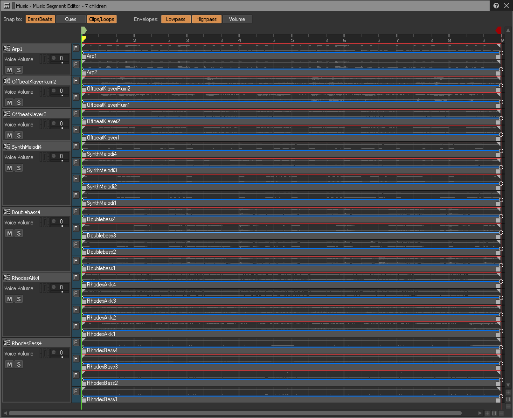

 
 

<h3> Bilag 6 </h3>

Lyden af pacmac når han dør

<video width="680" height="500" controls>
  <source src="pacman-death-sound.mp4" type="video/mp4">
Din brower understøtter ikke dette video tag, venlist skift browser.

</video>

 
 

Lyden af når pacman spiser et spøgelse

<video width="680" height="500" controls>
  <source src="pancan-eat-ghost-sound.mp4" type="video/mp4">
Din brower understøtter ikke dette video tag, venlist skift browser.

</video>

 
 

<h3> Bilag 7 </h3>

<embed src="Minigame1-time-schedule.pdf" width="800px" height="900px" />

 
 

<h3> Bilag 8 </h3>

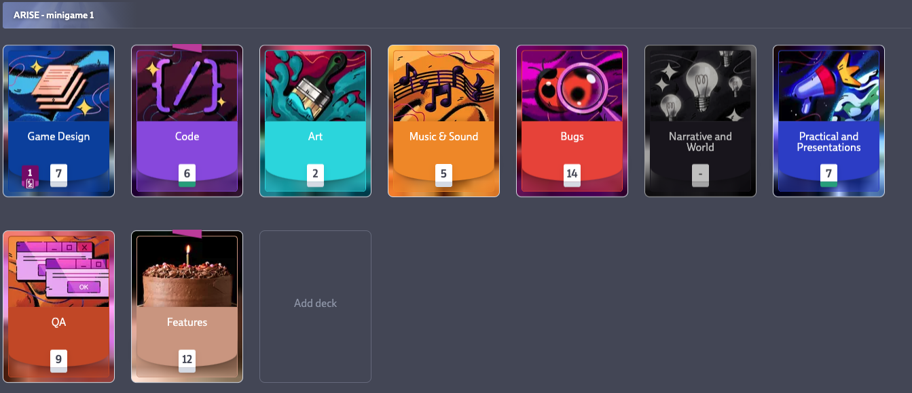

 
 

<h3> Bilag 9 </h3>

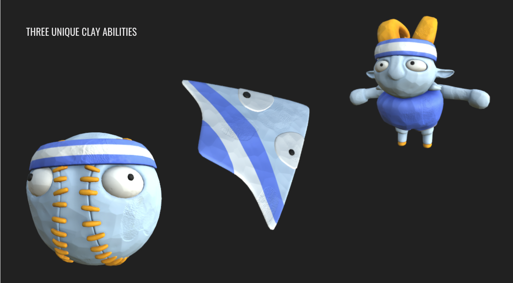

 
 

<h3> Bilag 10 </h3>

<video width="680" height="500" controls>
  <source src="muCLAYtion-2-video.mp4" type="video/mp4">
Din brower understøtter ikke dette video tag, venlist skift browser.

</video>

<h3> Bilag 11 </h3>

In-game musik fra level 1 til 10, main-menu musik og tutorial musik:

<iframe width="100%" height="200" scrolling="no" frameborder="no" allow="autoplay" src="https://w.soundcloud.com/player/?url=https%3A//api.soundcloud.com/tracks/919134622%3Fsecret_token%3Ds-gn8gZqW3ycE&color=%23ff5500&auto_play=false&hide_related=false&show_comments=true&show_user=true&show_reposts=false&show_teaser=true&visual=true"></iframe>
<a href="https://soundcloud.com/frederikbjoern" title="Frederik Bjørn" target="_blank" style="color: #cccccc; text-decoration: none;">Frederik Bjørn</a> · <a href="https://soundcloud.com/frederikbjoern/muclaytion-21-music-for-frederikbjorncom/s-gn8gZqW3ycE" title="MuCLAYtion 2.1 Music For Frederikbjorn.com" target="_blank" style="color: #cccccc; text-decoration: none;">MuCLAYtion 2.1 Music For Frederikbjorn.com</a>

 

<a style="text-decoration:none;font-family:times new roman;font-size:14px;text-decoration:none;">

Oversigt over opsætningen i Wwise:

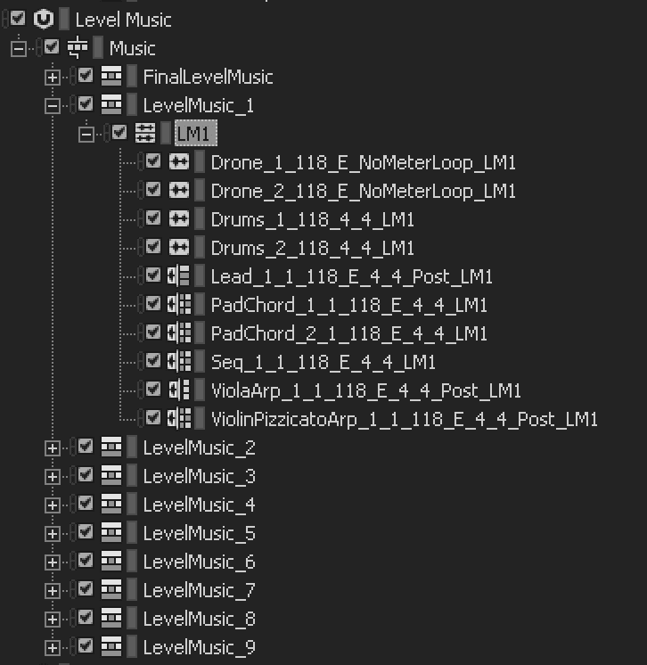

 
 

<h3> Bilag 12 </h3>

<embed src="GG One-pager.pdf" width="800px" height="1190px" />

 
 

<h3> Bilag 13 </h3>

Pre-pre produktions musik idé.

<audio controls>
<source src ="idea GG 13-10.mp3" type="audio/mpeg">
</audio>

<h3> Bilag 14 </h3>

Emotionel progression - Audio-visuel oversigt.

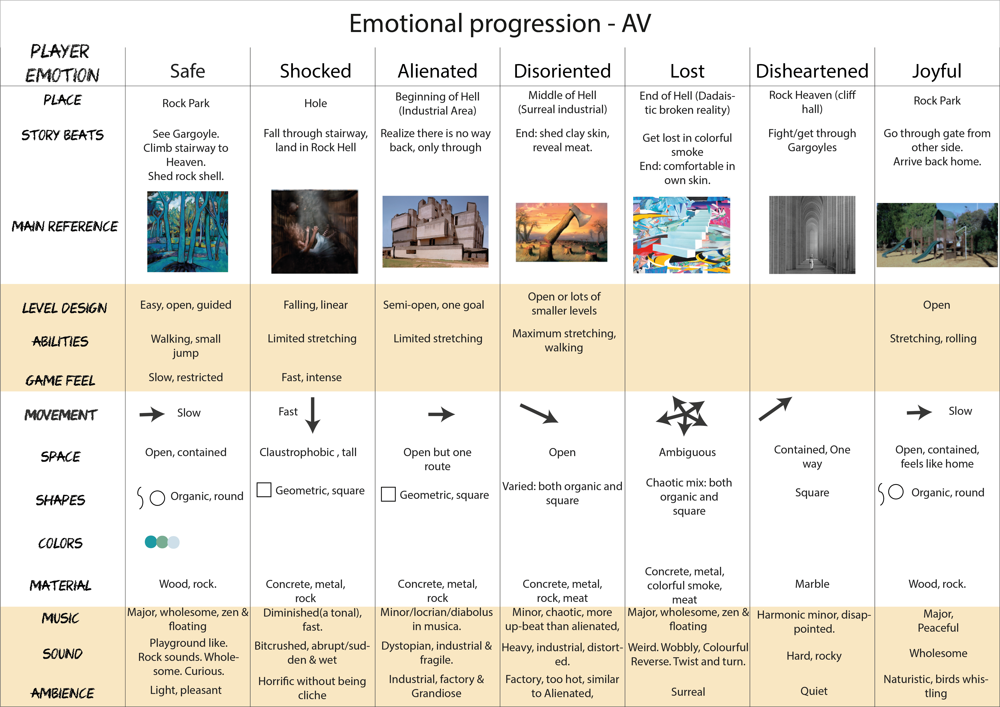

 
 

<h3> Bilag 15 </h3>

Core-mechanic, fra alpha sptrint stadie.

<video width="680" height="300" controls>
  <source src="core-mechanic-firest-stage.mp4" type="video/mp4">
Din brower understøtter ikke dette video tag, venlist skift browser.

</video>

 
 

<h3> Bilag 16 </h3>

Produktionsplan

<embed src="DADIU_ProductionPlan.pdf" width="800px" height="1180px" />

 

Timeline og milestones fra vores produktion

<embed src="timelineV8.pdf" width="800px" height="600px" />
 
<embed src="milestonesv6.pdf" width="800px" height="1180px" />

 
 

<h3> Bilag 17 </h3>

<em> Asset-brick </em>system

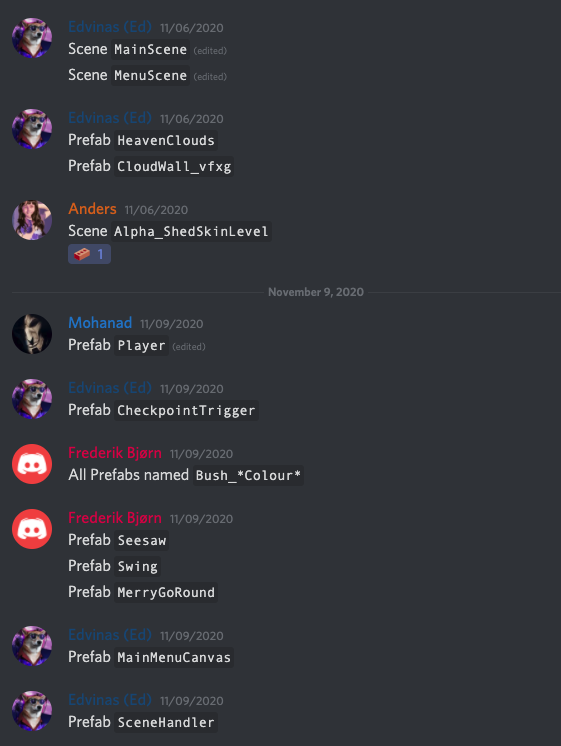

 
 

<h3> Bilag 18 </h3>

Hvem gør hvad, RACI system (Responsible, Accountable, Consulted & Informed)

<embed src="whodoeswhat.pdf" width="800px" height="1180px" />

<h3> Bilag 19 </h3>

Trello eksempel.
Kig på url-koden, de første tre tal er nummeret (tæller op fra 001) og derefter er beskrivelsen.

 

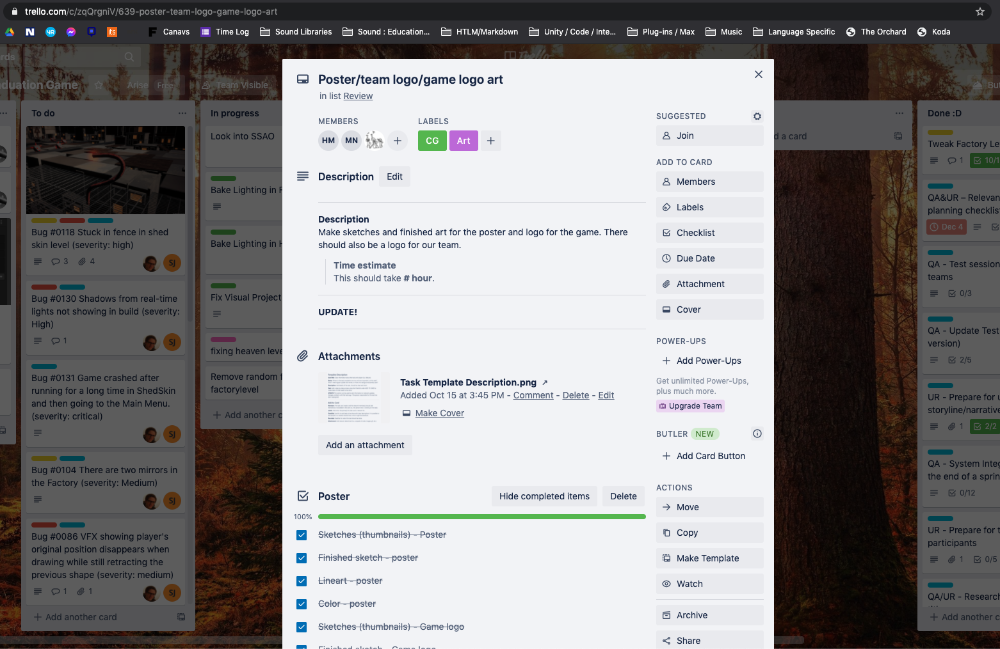

 
 

<em>frederikbjorn.com - 2020</em>

</a>

