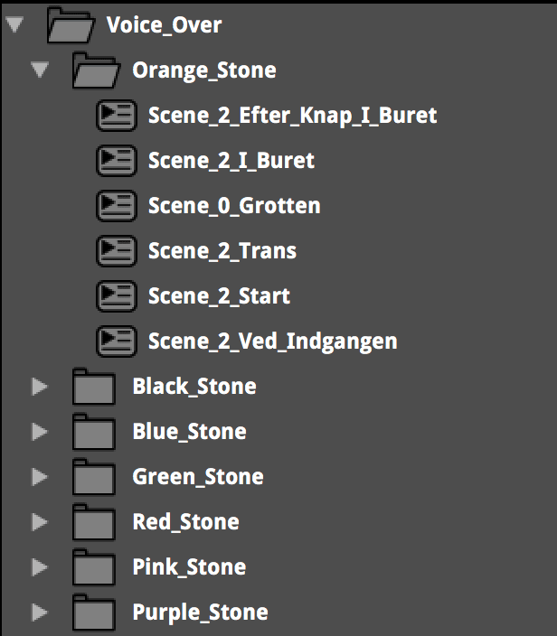
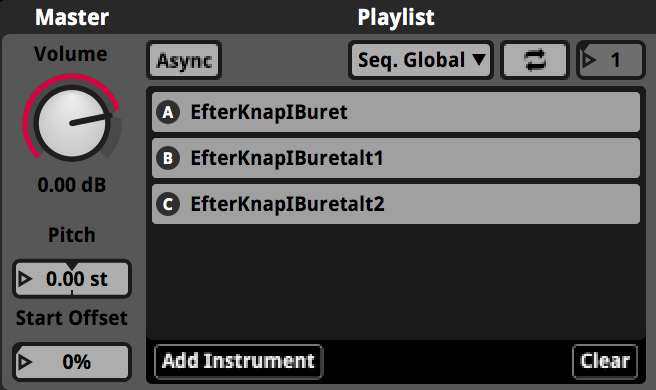
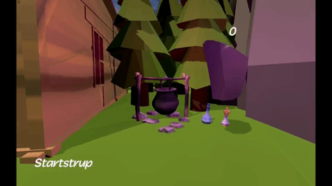

<a style="text-decoration:none;font-family:courier new;font-size:14px;text-decoration:none;">

<h2>En stenet affære</h2>



 

En stenet affære, meaning <em> a stone affair </em> is a solo game i made in a few weeks as a part of an exam in
game audio, unity usage and C# I did at Sonic College.
 
The game is a first person player platformer game. You start out in a small cosy village,
inhabited by round stone people in different colours.
As you walk around and talk with the different inhabitants, you'll soon encounter, <em>Thorstein</em>,
the purple stone. He sets the plot of the game, collect as many small rocks as you can and beat his evil cousin,
<em>den onde Olander</em>.
The game is made manly for kids between the ages of 6 and 10, and is therefore very joyful, colourful and the music
very easy and straight forward.

<h4> <em> Voice Over</em> </h4>

A big part of the game is the voice over. The voice over is made by seven different people, each with a corresponding colour.
The voice over is made to be very friendly and is the main tool driving the story along.
The reason for this is because voice is a very clear way of giving personality information to the player, think about
how you sense the difference in the personalities of the stones even though they are almost identical.

When instructing people in how to make good voice over, there are some key points to take into account.
- First, it is always preferable to get someone else. Sometimes the budget is tight and time is on the edge, but even
if you just need a few <em>HUMPF</em> sounds to randomly play by chance when the first person player jumps, it is very preferable
to get someone else to do it. There are a number of reasons for this, ranging from the often over processing of ones own voice,
to not being able to instruct yourself.
- Second, if you are able to get a voice actor of any level be aware that you want to avoid saying the line to the voice actor.
If you have a script, don't start out by saying the different lines how you want them to sound. Let the voice actor figure it out.
If you want to direct, which you should always do, use specific descriptions like; <em>imagine you just jumped out of a birthday
cake at a surprise-party</em> or something like; <em>imagine you are the only seagull to get a piece of bread and now you are flying
back to your secret seagull lair on top of a mountain</em>.

The way the voice over is made in FMOD is quite simple; it is just a multi-instrument with the playlist set to <em>Sequence Global</em>
(this would be a random container in Wwise).
This means that you have to the clips playing sequenced and gives you 100% control of the order the voice over is playing in.
To create variations, you can put a multi instrument inside of the sequenced multi instrument and add multiple audio clips.
 
In unity, I very simply, just had a collider the size in which i wanted the voice over to trigger and had a small script saying;

OnTriggerEnter (collider other)
 if (other.gameObject.tag == Player)
 {
     vocieover_Scene_2_Efter_Knap_I_Buret = FMODUnity.RuntimeManager.CreateInstance("event:/Voice_Over/Orange_Stone/Scene_2_Efter_Knap_I_Buret");
     vocieover_Scene_2_Efter_Knap_I_Buret.start();
 }

All in all the making of <em>En stenet afærre</em> was a fun and reward full experience.
Since this was the first game that I ever made, there are a lot of things I would do different.
I think making a game all by yourself is very difficult, but a very good way of learning the basics of unity and scripting in C#.

 

<em> - This was a part of an exam in Game audio at Sonic College.</em>

 
 
 
 
 
 
 
 
 
 
 
 
 
 
 
 
 
 
 
 
 
 
 
 
 
 
 
 

 
 
 

<em>frederikbjorn.com - 2020</em>

 

</a>
