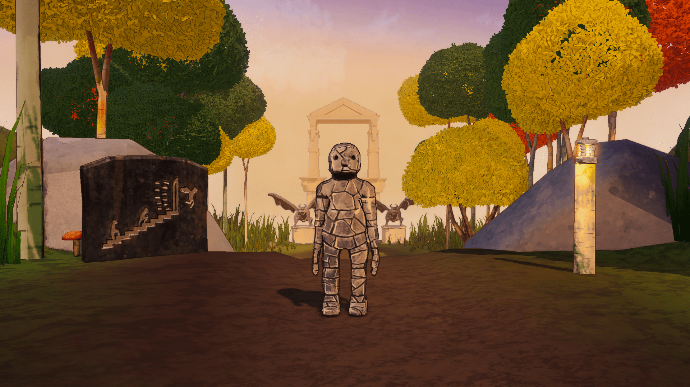
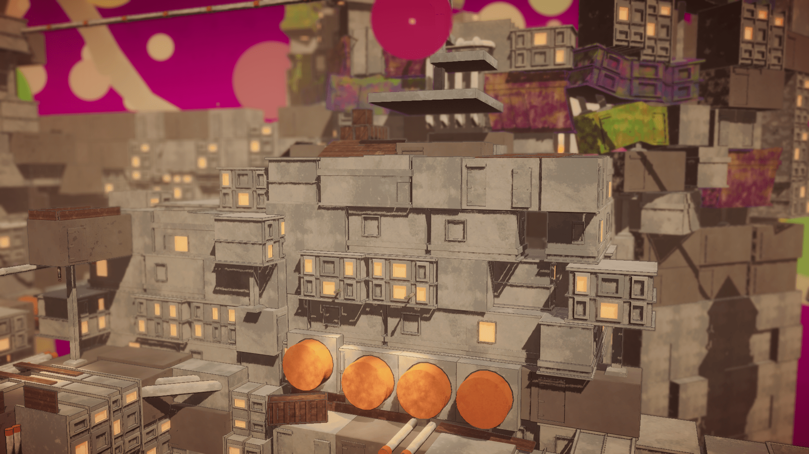
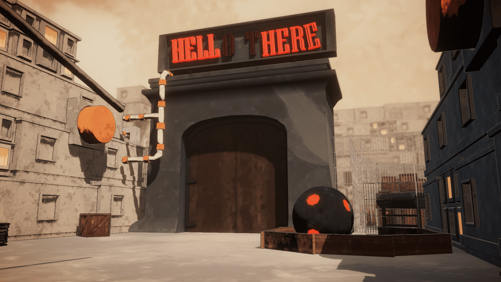
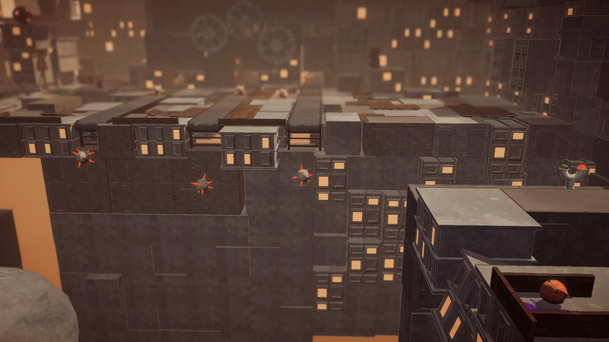

---
description: Game Audio
summary: Gneiss // A misshapen Journey. A game about morphing out of your own crysis.
title: 
date: 2020-12-07
tags:
  - Game Audio
  - Wwise
  - DADIU
  - ARISE

---

<a style="text-decoration:none;font-family:courier new;font-size:14px;text-decoration:none;">

<h2>Gneiss : A Misshapen Journey</h2>



 

The game is free and is downloadable from my itch.io page:

<a href="https://frederikbjorn.itch.io/">
<em><h6><strong>https://frederikbjorn.itch.io/</strong></h6></em>
</a>

<a style="text-decoration:none;font-family:courier new;font-size:14px;text-decoration:none;">

 

Gneiss tells the story of overcoming you own personal struggles and crisis in life. The first scene of game
presents the main character Gneiss in his rock shape in an idyllic park. Through a few slides and some Volapük inspired
voiceover, we are presented with the struggles of Gneiss; Gneiss does not fit in with the other rock people in the park.
They are all admiring the robust and solid foundations of the gargoyles whom live above in heaven.
On this very day, Gneiss is singled out as the one rock person who gets to go to heaven, but in the attempt the stairs to
heaven breaks and Gneiss falls all the way down to hell.
 
When Gneiss then hits the ground his rock shell breaks and he becomes a meaty lump that can be any shape desired by the player.
Now Gneiss has to use his newly found powers to make his way through hell, into heaven and back to his home.

 
    
My discipline in the production was one of two sound designers in a team of 23 people.
The team was made up of all the same disciplines as you would find in a bigger games studio; director, pruducer, art director, quality assurance/user researchers, computer graphic personnel,
programmers, game & level designers and sound designers.
When working on a project like this, communication and discipline is extremely important. We were working in a scrum-like system
with weekly sprints to enhance productivity. I had never done this before, and I was very pleasantly surprised of the sheer amount
of work we all cloud do in just a single week.
In terms of the tools and ways of implementing the sound design, we had a very close collaboration with the programmers to create
audio specific scripts and other versatile tools. Like; an Occlusion system, an Impact detector, a Velocity Trigger ect.

 

 
 

 

<em> - This was the final graduation game of my autum 2020 semester at the National Academy of Digital Interactive Entertainment (DADIU).</em>
n
 

<em>frederikbjorn.com - 2020</em>

</a>
