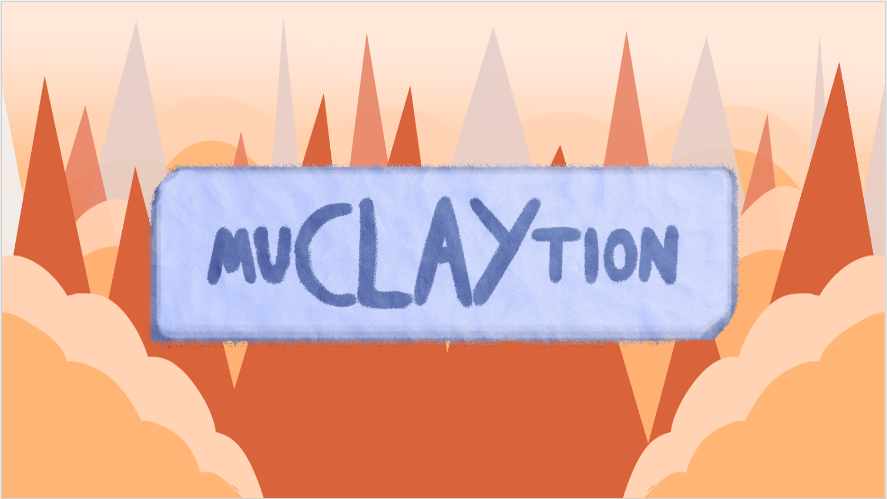
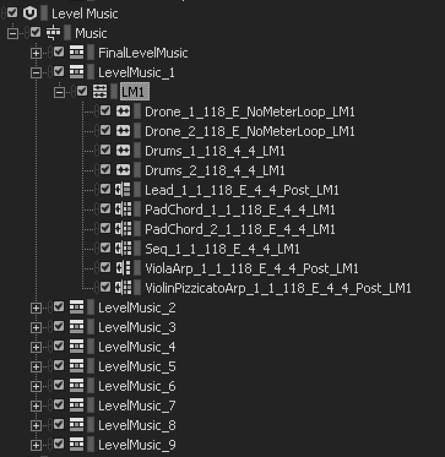

<a style="text-decoration:none;font-family:courier new;font-size:14px;text-decoration:none;">
<em><h3>Making a game in eight days</h3></em>

 

 

At my team in DADIU, we got the assignment to make a game in eight days. 
This was a part of learning how to work as a team and get ready for working on a much bigger and hopefully better game.
The game is a 3D arcade came where you can mutate in to three different characters and it is called, muCLAYtion.
 
Her is a small playthrough of the game:



 

The team was made up of 23 people, each with different disciplines like;
director, programmer, art-director, computer graphics, quality assurance etc.
I was part of the sound team with one other person. 
 
When making a game in a team this size there are certain issues which are very prevalent.
One of these issues is just basic communication and making sure everyone is working for a common goal.
Another issue is the fact that as a sound designer you are very dependant on other peoples work. You need
the game and level designers to work you a level, then you need the art time to make some assets and animations, and
by the time the game is ready for sound, there is really not a long time to implement.
Especially not when making a game in eight days.
 It was very interesting and fun to work on a game in such a small amount of time and
it made us really focus on what was necessary in order for the game to work.  
 
In terms of the sound design, we made some different sounds for the three different characters, footsteps,
transitions between the mutations, respawn and death trigger sounds etc.
These were all made to sound very cartoon-ish and playful. One of the was we
achieved was to use very exaggerated sounds and add a lot of synthesis layering made with a
juno-106 emulation from TAL.
 

<h4> <em> Music</em> </h4>

The thing we used the most time making was the music. Since this is an arcade game,
music was really needed to drive the game forward. The way we chose to make this happen was by having 
Please listen to some of the music. In the link you can find music to level 1 through 10,
the main menu music and the tutorial music.
  Please take note of the progression of the level music.
 
 

</a>

<iframe width="100%" height="200" scrolling="no" frameborder="no" allow="autoplay" src="https://w.soundcloud.com/player/?url=https%3A//api.soundcloud.com/tracks/919134622%3Fsecret_token%3Ds-gn8gZqW3ycE&color=%23ff5500&auto_play=false&hide_related=false&show_comments=true&show_user=true&show_reposts=false&show_teaser=true&visual=true"></iframe>
<a href="https://soundcloud.com/frederikbjoern" title="Frederik Bjørn" target="_blank" style="color: #cccccc; text-decoration: none;">Frederik Bjørn</a> · <a href="https://soundcloud.com/frederikbjoern/muclaytion-21-music-for-frederikbjorncom/s-gn8gZqW3ycE" title="MuCLAYtion 2.1 Music For Frederikbjorn.com" target="_blank" style="color: #cccccc; text-decoration: none;">MuCLAYtion 2.1 Music For Frederikbjorn.com</a>

 
 
<a style="text-decoration:none;font-family:courier new;font-size:14px;text-decoration:none;">

Creating a 10 level music system for a game made in eight days is certainly a big feat. I had all the music going in loops
in the differet levels, with transitions between them. 
One thing to keep in mind when making this arcade-style of music is that a player can often stay at the same levels for quite
some time. Therefore it is important to change up certan things in a looped based system like this.
  

One thing you can do is to create different voicings for your keys and strings. For triads that would create three
different variations, the 1st inversion, the 2nd inversion and the 3rd inversion.
As we can see in the picture, the files, PadChord 1/2, the sequencer, the Viola arpeggiator and the
Violin pizzicato arpeggiator all has multiple sections under the level 1 music. The small icon next to the name
indicates it is containing multiple sound loop in a random container, a sequence container or any of the other ones.
This means the loops are either shuffling randomly, playing in a loop based sequence or it can be controlled through a game sync.
 
 
Anonther example of how this loop is creating constant randomisations i through the lead, which plays a melody.
As we can see from the small icon next to the lead name, it is a sequence of melodies. All based on the same melody,
but which slight changes in rythm and phrasing.
 
 
<em>- This project was a part of a semester at National academy of digital interactive entertainment (DADIU)<em/>
 
 
<em>frederikbjorn.com - 2020</em>
 

</a>
