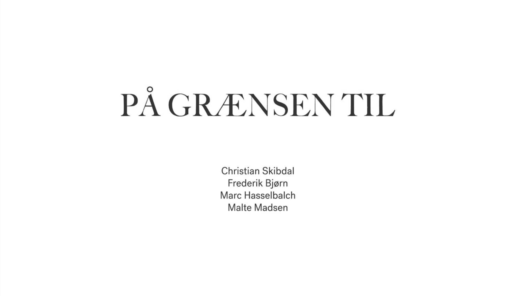

<iframe width="80%" height="200" scrolling="no" frameborder="no" allow="autoplay" src="https://w.soundcloud.com/player/?url=https%3A//api.soundcloud.com/tracks/912628837%3Fsecret_token%3Ds-HRcQYK6JKbe&color=%23e26735&auto_play=false&hide_related=false&show_comments=true&show_user=true&show_reposts=false&show_teaser=true&visual=true"></iframe>
<a href="https://soundcloud.com/frederikbjoern" title="Frederik Bjørn" target="_blank" style="color: #cccccc; text-decoration: none;">Frederik Bjørn</a> · <a href="https://soundcloud.com/frederikbjoern/pa-graensen-til/s-HRcQYK6JKbe" title="På Grænsen Til" target="_blank" style="color: #cccccc; text-decoration: none;">På Grænsen Til</a>

<a style="text-decoration:none;font-family:courier new;font-size:14px;text-decoration:none;">

 

<!---->

A podcast about the christian brotherhood of the Moravian Church (ger. "Herrnhuter Brüdergemeine")based in the danish village of Christiansfeld.
The Moravian Church has an interesting and very global history, this podcast focuses on the danish fraction which centres in and around Christiansfeld.
 
The podcast was a collaboration with the 100 year anniversary of the reunification of Denmark; genforeningen2020.dk/
 
A podcast by, Christian Skibdal, Marc Hasselbalch, Malte Madsen & Frederik Bjørn
 
 
<em> - This was a part of an exam in Sonic communication and project management at Sonic College.</em>
 
 
<em>frederikbjorn.com - 2020</em>
 

</a>
