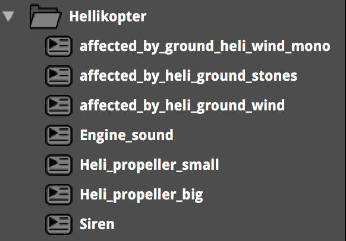
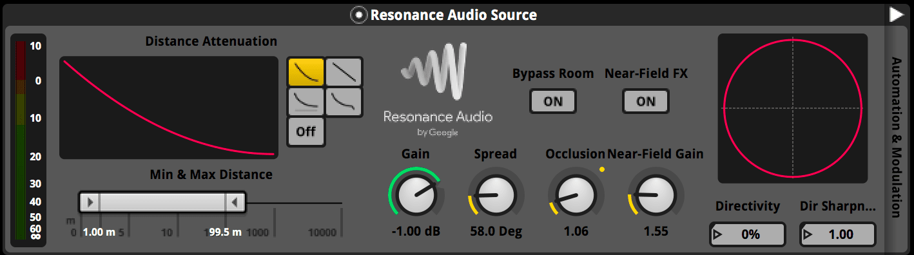
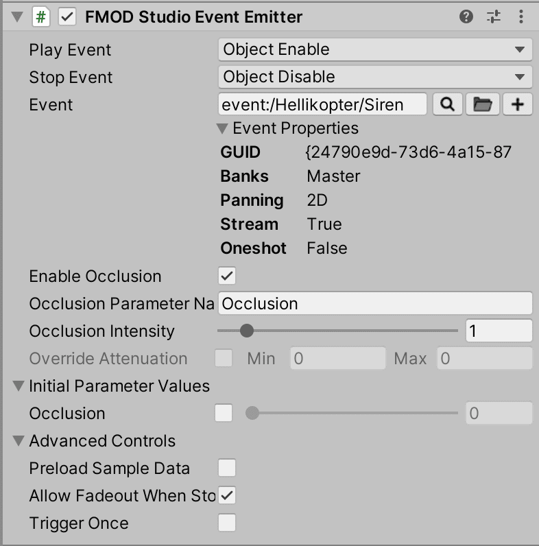
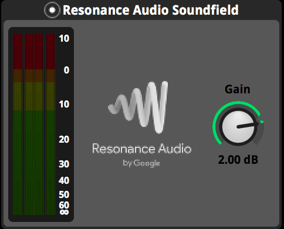

<a style="text-decoration:none;font-family:courier new;font-size:14px;text-decoration:none;"> 

<h3> How to make a Helicopter using Google resonance in FMOD, working with ambisonics and occlusion </h3>



 

<em>- Please be aware that using the different ambisonic tools by Google resonance has
to route through the Resonance Audio Listener to work in unity.</em>

<em>How i made the helicopter sound:</em>
 

First i made a brainstorm of the different sounds a helicopter can make, what objects can get affected
by a helicopter and how they would sound in this specific situation, and how these two approaches correlate.
As you can see from my folder structure, I decided on haveing the following events;
 - An engine event with multible engine sounds playing loops in async. 
 - A big propellor event with a sound of the air being pushed and some flicking noise made with a synthesizer.
 - A small propellor event with a faster flickering noise, also made using a synthesizer.
 - A siren event, for dramatic effect (1312). 
 - An event, placed at ground level, contaning layered mono sounds of heavy wind.
 - An event which triggers when the player is just under the helicopter, containing four different quadrophonic audio files of
wind, all spatialised out in different directions* and played in async of each other.
 - An event that triggers in the same way as the previous, but playing the sound of gravel flying all around the player**.
 
 
I think it is a good approach to make this kind of brainstorm and to research how the object you are trying to
reproduce actually sounds like in real life before you actually start making the sound.
You can do this by waching videos or even better; take a stroll and search for the object, like in my case; a helicopter.
In this approach there are two key things to keep in mind
 (a) <em>Where are the sounds comming from? Where on the actual soundsource, front or back?
Or is it a sound occurring because the soundsource is affecting other physical objects. </em>
 (b) <em>How does the sound reach you? Is it occluded on the way? Is it reflected onto a surface like a big building? </em>
 

<h4><em>Occlusion</em></h4>

 

In the Google Resonance Audio Source we have a knob called; occlusion. This refers to how muffled the sound is,
it can ether occur because there is something inbetween the soundsource and the listener, or because the soundsource is far away from the listener.
It is achived by a complex filtering of the sound which correlates to the real world physics of how soundwaves travel through the air.
In FMOD you make a parameter called Occlusion and then map the Resonance Audio Source occlusion knob onto the
automation of this parameter and set the values as you please.
This occlusion parameter can also be handy in controlling different reverb and delay settings.
Like on the siren sound I mapped the reverb time, reverb level, amount of early vs. late reflections and some delay to the occlusion parameter.
This was, together with the occlusion filtering, a way of futher muffleing out the sound of the siren.
It is audable, although very subtle, but listen to the siren when the helicopter is behind one of the boulders (1:30).

 
 

In this explenation i won't cover how to actually script the specifics in C# but I higly recommend checking out Alessandro Famà toturial on the subject***.
Nonetheless as you can see i have a text box where i can enter the name of my parameter as a string and a slider to easily control the
intenity of the oclussion from unity.

<h4><em>Triggering the ambisonics in Unity</em></h4>

So working with ambisonic sounds requires a DAW that can handle different surround formats (like Reaper or Pro Tools HD) and
a spatialiser program like FB360***.

  

In FMOD I used the Google resonance tool, called Resonance Audio Soundfield.
This makes sure the audio is send as a quadrophonic audio file to the Resonance Audio Listener which should be on the master channel.
Please note that this bypasses the original mixer used in FMOD an routs all auido through the Resonance Audio Listener - Mono, Stereo og surrond format.

<em>- This project was a part of an exam in 3D audio at Sonic College<em/>

 

<a href="https://frederikbjorn.com/posts/working-with-google-resonance-in-fmod-the-music/">
<em><h6><strong>* Made with the tool, FB360, see post about creating music with FB 360. Click here for redirection to the FB360 guide.</strong></h6></em>
</a>
<em><h6><strong>** Made with a program called, Sound Particles made by a company under the same name.</strong></h6></em >
<a href="https://alessandrofama.com/tutorials/fmod-unity/occlusion/">
<em><h6><strong>*** A guide to occlusion scripting by Alessandro Famà. Click here for redirection to the occlusion guide.</strong></h6></em>
</a>
 

<a style="text-decoration:none;font-family:courier new;font-size:14px;text-decoration:none;">

<em>frederikbjorn.com - 2020</em>
 

</a>

