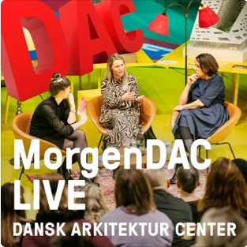
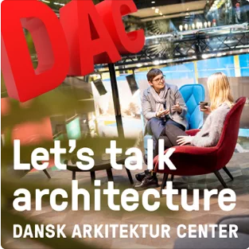
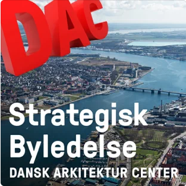
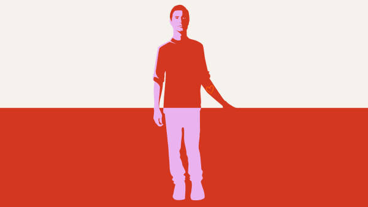
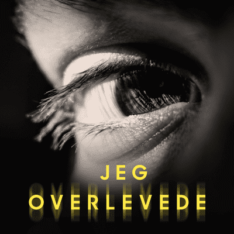

<a style="text-decoration:none;font-family:courier new;font-size:14px;text-decoration:none;"> 

 

<strong><h4>Need help producing a podcast?</strong></h4>

 

After one year in the industry and a bachelor in sound design, I have aquired expertise in;

       - recording podcasts, 
       - composing soundscapes and 
       - post-production of podcast and radio.
  At my current work at Munck Studios Copenhagen, I have also gained an understanding of producing and content.
So, if you have an idea or just want to get better at producing podcasts, please contact me!

 

If you need help with production of a podcast, please contact me at fbjoern18(at)gmail.com.
 
 I can work in both danish and english.

<a style="text-decoration:none;font-family:courier new;font-size:14px;text-decoration:none;"> 

____________________________________________________________________________________

<a style="text-decoration:none;font-family:courier new;font-size:14px;text-decoration:none;"> 

Here are some exmaples of my work, most are related to my work at Munck Studios Copenhagen or as a part of my education at Sonic College. 
Since all of my work is based in Denmark, all of these examples are in danish.

____________________________________________________________________________________

<h3> Uden Titel </h3>

A podcast about art produced for P1 at Danmarks Radio.

<em><h6>https://www.dr.dk/lyd/p1/uden-titel</h6></em>

 

____________________________________________________________________________________

<a style="text-decoration:none;font-family:courier new;font-size:14px;text-decoration:none;"> 

<h3> Different work for the danish architecure center </h3>

In my work at Munck Studios, I was to deal with the podcast output of the danish architecure center.
This included three different podcasts;
  
<strong>MorgenDAC</strong>, a podcast based around a morning seminar of two people and a moderator, about themes like; tourism in Copenhagen, how to make a city green, how to build a city which is biking friendly, and many many more!
My work consisted of helping with the speak, editing and mixing the podcast.
 <em>The podcast is in danish</em>

https://podcasts.apple.com/dk/podcast/morgendac-live/id1492082141?l=da

 

 
 
 
 

<a style="text-decoration:none;font-family:courier new;font-size:14px;text-decoration:none;"> 

<strong>Let's talk architecture</strong>, a podcast about different locations and ideas, usually with one or two guests. 
My work consisted of editing and mixing the podcast.
 <em>The podcast is in english</em>

https://podcasts.apple.com/dk/podcast/lets-talk-architecture/id1492098620

 

 
 
 
 

<a style="text-decoration:none;font-family:courier new;font-size:14px;text-decoration:none;"> 

<strong>Strategisk byledelse</strong>, a podcast for people who work with the development of cities.

My work consisted of editing, feedback to the interviewers and mixing the podcast.
 <em>The podcast is in danish</em>

https://podcasts.apple.com/dk/podcast/strategisk-byledelse/id1531451763

 

 

____________________________________________________________________________________

<a style="text-decoration:none;font-family:courier new;font-size:14px;text-decoration:none;"> 

<h3>DRC Integration</h3>

A podcast i produced for DRC/Dansk Flygtningehjælp about there integration of the neurosequential models of therapeutics.

Link for more infromation (in danish):
<em><h6>https://www.drc.ngo/da/vores-arbejde/ydelser-og-losninger/integration-i-danmark/aktuelt/podcast-april-2022/</em></h6>

 

<iframe width="100%" height="300" scrolling="no" frameborder="no" allow="autoplay" src="https://w.soundcloud.com/player/?url=https%3A//api.soundcloud.com/tracks/1252880398&color=%23ff5500&auto_play=false&hide_related=false&show_comments=true&show_user=true&show_reposts=false&show_teaser=true&visual=true"></iframe>
<a href="https://soundcloud.com/danishrefugeecouncil" title="DRC" target="_blank" style="color: #cccccc; text-decoration: none;">DRC</a> · <a href="https://soundcloud.com/danishrefugeecouncil/podcast-fra-drc-integration" title="Podcast fra DRC Integration" target="_blank" style="color: #cccccc; text-decoration: none;">Podcast fra DRC Integration</a>

 
____________________________________________________________________________________

<a style="text-decoration:none;font-family:courier new;font-size:14px;text-decoration:none;"> 

<h3> Det vi går rundt med : Casper Eric </h3>

A podcast produced for P1 at Danmarks Radio.

<em><h6>https://www.dr.dk/lyd/p1/det-vi-gar-rundt-med</h6></em>
</a>

 

 
 

<a style="text-decoration:none;font-family:courier new;font-size:14px;text-decoration:none;"> 

____________________________________________________________________________________

<h3> Jeg overlevede : Jeg overlevede et lynnedslag</h3>

An episode in the <strong>Jeg overlevede</strong>-series, produced for podimo (sorry for the paywall).

<em><h6>https://podimo.com/dk/shows/73a0ba18-0749-41a7-91b0-87d7e74cc4d5/episode/ee450532-773f-4d64-80fe-2bc5d8bb2246
</h6></em>

 

____________________________________________________________________________________

<a style="text-decoration:none;font-family:courier new;font-size:14px;text-decoration:none;"> 

<h3>På Grænsen Til</h3>

A podcast made as partan exam in sonic communications and project management, about the christian
brotherhood of the Moravian Church (ger. "Herrnhuter Brüdergemeine")
based in the danish village of Christiansfeld.
The Moravian Church has an interesting and very global history,
this podcast focuses on the danish fraction which centers in and around Christiansfeld.
 

The podcast was a collaboration with the 100 year anniversary of the reunification of Denmark.
For more info, please visit their website:

<em><h6>https://graenseforeningen.dk/om-graenselandet/graenselandets-historie/genforeningen-2020</h6></em>
</a>

 

<a style="text-decoration:none;font-family:courier new;font-size:14px;text-decoration:none;"> 

<iframe width="100%" height="200" scrolling="no" frameborder="no" allow="autoplay" src="https://w.soundcloud.com/player/?url=https%3A//api.soundcloud.com/tracks/912628837%3Fsecret_token%3Ds-HRcQYK6JKbe&color=%23e26735&auto_play=false&hide_related=false&show_comments=true&show_user=true&show_reposts=false&show_teaser=true&visual=true"></iframe>
<a href="https://soundcloud.com/frederikbjoern" title="Frederik Bjørn" target="_blank" style="color: #cccccc; text-decoration: none;">Frederik Bjørn</a> · <a href="https://soundcloud.com/frederikbjoern/pa-graensen-til/s-HRcQYK6JKbe" title="På Grænsen Til" target="_blank" style="color: #cccccc; text-decoration: none;">På Grænsen Til</a>

 
 

<a style="text-decoration:none;font-family:courier new;font-size:14px;text-decoration:none;"> 

____________________________________________________________________________________

<em>frederikbjorn.com - 2022</em>

 

</a>

