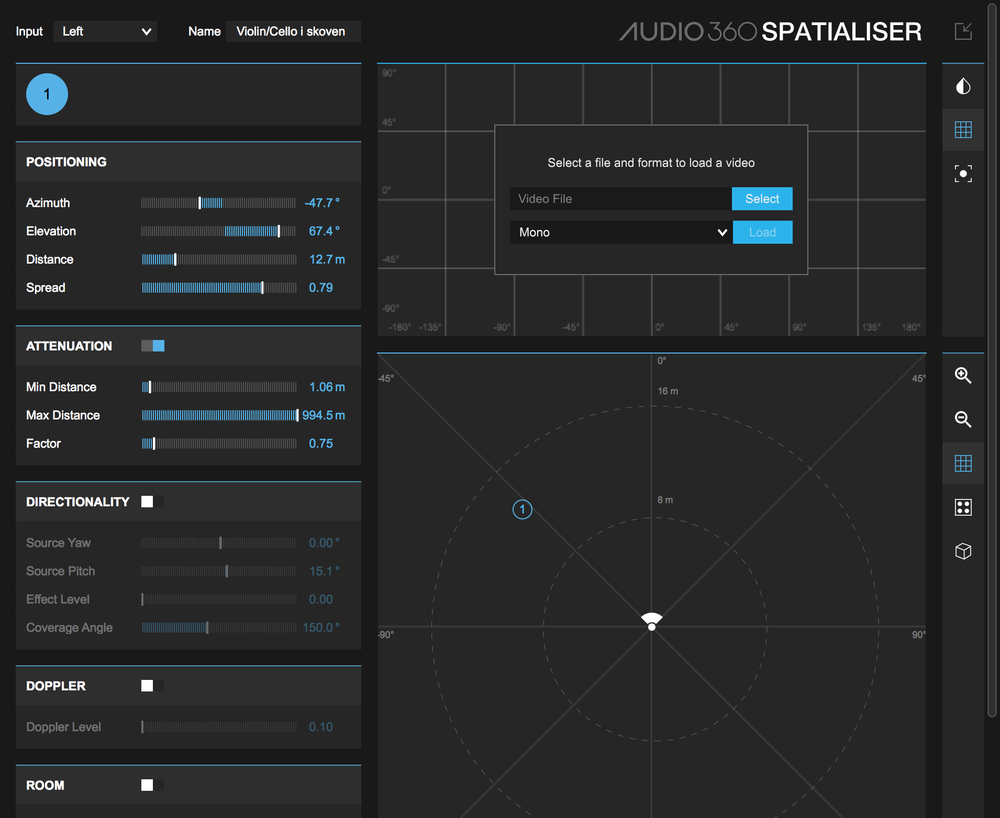

<h3>How to make a ambisonic music using Fmod, Google resoncance and FB360</h3>



 

<em>Please be aware that using the different ambisonic tools by Google resonance has
to route through the Resonance Audio Listener to work in unity. </em>
 
Most of the music in this video is made using a tool called FB360, made by facebook for their 360° video platform.
 
 

 
It is a very powerful tool for creating music in a lot of different surround formats, for games and films.
Not all DAWS can work with surround, as far as i know, only Reaper and Pro Tools HD has the functionality as of writing this (sorry Ableton users).
FB360 is free and user friendly, so feel free to check it out.
 Link: <em>https://facebook360.fb.com/spatial-workstation/</em>
 

So the FB360 Spatialiser plug-in has some different fuctions, but I will focus on the Positioning and Attenuation.
<h4> <em> Positioning:</em> </h4>
<em>Azimuth;</em> refers to where around you the sound is playing and is measured in 360°.
 <em>Elevation;</em> refers to the sound being below or above you and is mesured in 180°
 <em>Distance;</em> is basically a fader with some complex HRTF (head related transfer function) filtering added to give sensation that the sound source is eather close or distant. It is measured in meters.
 <em>Spread;</em> refers to the size of the audio. E.g. if you have the sound of a train, it is going to sound wired if it has a small spread
because a train in the real world has sounds comming from a lot of different places.
With spread it is important to think about how the sound would naturally be heard.
 
<h4> <em> Attenuation:</em> </h4>
Min & max distances are self explenatory but the factor slider is the attenuation curve where a value of 1 is a 6dB drop everytime
the distance is doubled. This is how most sounds work in the real world.
 
In the example in the video, I had some strings with a bit of reverb which i processed as seen in the picture above.
The important thing in this example was the spread parameter. When working with music in ambisonics you have to <em>"correct"</em> way
of setting your spead parameter since there is no real world refrence. I choose to have a high level of spread because humans are accustomed to hear
music extra-diegeticly from movies and games.
To get a feel for how the i would be to move around this sound in the game, you can drag the (1) symbol around the 360° grid.

 
After finding the settings i liked the best, i made a few variant chords (to add randomiation in the game)
and bounced a quadraphonic audio file out of Reaper.
 
Then i set up a Multi Instrument with my different variant string chords and put a Google Resonance Audio Soundfield on my master.
In unity i had a boxcollider to trigger my music. It is very important to keep in mind that audio playing through the Google Resonance Audio Soundfield
component will play everywhere. Therefore triggers and faders and what not is very important.
 Cheers.