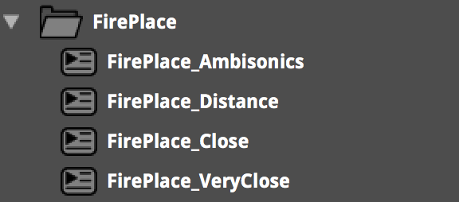
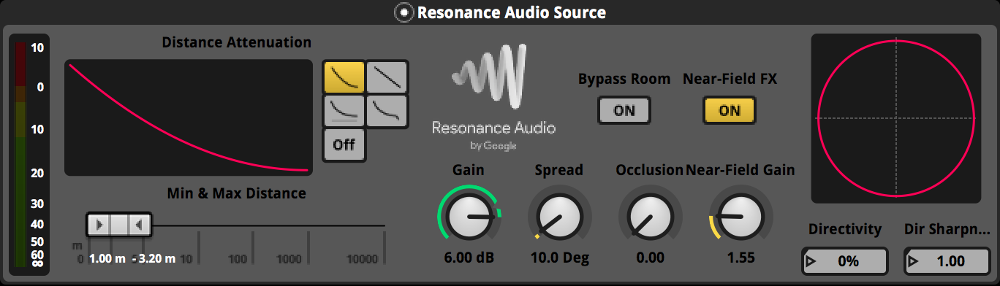

<h3>How to make a Fireplace using Google resonance</h3>



 

<em>Please be aware that using the different ambisonic tools by Google resonance has
to route through the Resonance Audio Listener to work in unity. </em>
 

<em>How I made the fireplace sound:</em>
 
So the fireplace is made up of four different events. Three of the events are all mono,
comprised of different length loops, which are recordings of a fireplace with different distances.
The fourth loop is an ambisonic sound, which we will come back to.
First; the three mono events which all utilise the Google resonance tool, <em> Resonance Audio Source</em>,
basically Google resonance was of fitting a mono sound source in a 3D world.    

Here we see the Resonance Audio Source for the FirePlace_VeryClose event.
A quick walk through of this tools is that we use to determine from how far/close we can here the sound, and how the attenuation and spread affects the sound.
Here for instance we have max. distance value very low, 3.20 meter, with a pretty steep attenuation curve, this means that we will only be able to hear the sound very close. 
The spread parameter is very low, which means the sound is very directional.
A bit of nearfield gain is added to give the sound maximum focus when you are close enough to it.

The two other events, <em>FirePlace_Distance</em> & <em>FirePlace_Close</em> are variants of the <em> FirePlace_VeryClose </em>
example but with different samples (recorded accordingly to the distance in the game), different min & max distance values and different spread.

 

The last sound which is the quadrophonic ambisonic sound is made using another of the Google resonance tools;  <em> Resonance Audio Soundfield </em>
 
This event is made up of a single perfect loop recorded with a Senheiser Ambeo VR Mic.
The microphone records a singe quadraphonic recording and consists of four microphones with cardioid characteristic in perfect phase.
<!-- indsæt et link til jones og lars krimis ambisonics bibliotek -->
As you can see, an Resonance Audio Soundfield event does not have any parameters for tweaking distance or spread. When you load
an Resonance Audio Soundfield event in unity it is going to play everywhere, by getting around this, we can have a trigger in unity.
I don't want to get too deep into unity sound implementation in this post, but I'll try to summarize.
So basically, in unity, i call the event with the FMOD Studio Event Emitter, with a box collider as trigger.
Then I have an Audio Parameter Fader script which allows me to fade in the sound as you enter the collider.
(very basic I know, if you would like a more in-depth walkthrough, please don't hesitate to get in touch)
 
 
<em>- This project was a part of an exam in 3D audio at Sonic College<em/>

